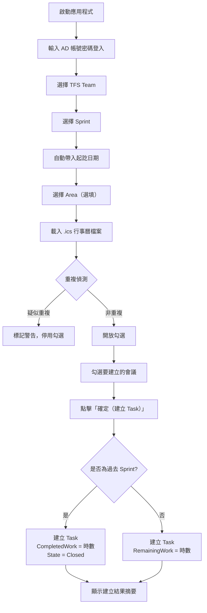
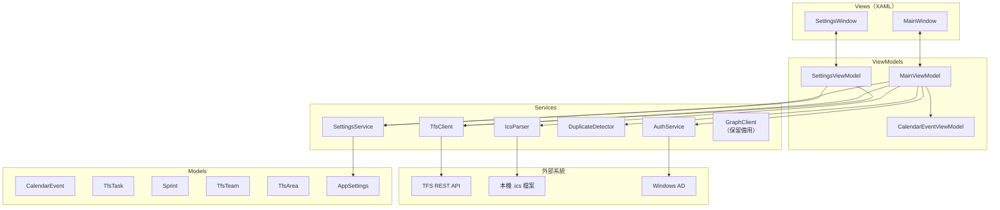
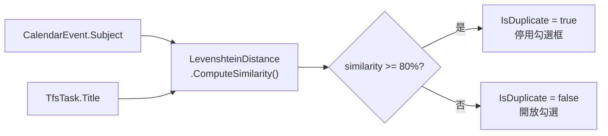

# M365 TFS 行事曆同步工具

將本機 `.ics` 行事曆檔案中的會議，自動同步建立為 TFS / Azure DevOps Kanban 看板上的 Task。

---

## 功能特色

- 透過公司 AD 帳號密碼驗證登入
- 匯入本機 `.ics` 行事曆檔案（從 Outlook 匯出）
- 選擇 TFS Team / Sprint / Area
- 選擇 Sprint 後自動帶入行事曆查詢起訖日期
- Levenshtein Distance 演算法自動偵測重複任務
- 批次建立 TFS Task，自動填入：
  - 標題格式：`yyyy/MM/dd 會議主旨`
  - Original Estimate / Remaining Work（會議時數）
  - 過去 Sprint：自動設 CompletedWork、State = Closed
- 設定以 DPAPI 加密儲存於本機

---

## 使用流程



---

## 架構



---

## 專案結構

```
M365TfsSync/
├── App.xaml.cs                     # DI 容器設定
├── Models/
│   ├── CalendarEvent.cs
│   ├── TfsTask.cs
│   ├── Sprint.cs                   # 含 DisplayName（最後兩層路徑）
│   ├── TfsTeam.cs
│   ├── TfsArea.cs                  # 含 DisplayName
│   ├── AppSettings.cs
│   └── AuthMode.cs
├── ViewModels/
│   ├── ViewModelBase.cs
│   ├── RelayCommand.cs
│   ├── MainViewModel.cs
│   ├── SettingsViewModel.cs
│   └── CalendarEventViewModel.cs
├── Views/
│   ├── MainWindow.xaml
│   └── SettingsWindow.xaml
├── Services/
│   ├── Interfaces/
│   │   ├── IAuthService.cs
│   │   ├── ITfsClient.cs
│   │   ├── IDuplicateDetector.cs
│   │   └── IGraphClient.cs
│   ├── AuthService.cs
│   ├── TfsClient.cs
│   ├── IcsParser.cs
│   ├── DuplicateDetector.cs
│   ├── LevenshteinDistance.cs
│   ├── SettingsService.cs
│   ├── GraphClient.cs              # 保留備用（未啟用）
│   └── Exceptions.cs
└── Converters/
    └── BoolToVisibilityConverter.cs

M365TfsSync.Tests/
├── Unit/Services/
│   └── DuplicateDetectorTests.cs
└── Properties/
    └── LevenshteinDistancePropertyTests.cs
```

---

## 重複偵測演算法

使用 **Levenshtein Distance** 計算會議主旨與現有 TFS Task 標題的相似度：



相似度公式：
```
similarity = (1 - editDistance / max(len(s1), len(s2))) * 100
```

---

## 設定儲存

設定以 **Windows DPAPI** 加密，儲存於 `%APPDATA%\M365TfsSync\settings.dat`，與 Windows 使用者帳號綁定，其他使用者無法解密。

| 設定項目 | 說明 |
|----------|------|
| TFS 伺服器 URL | 例如 `http://tfs.company.com/tfs` |
| TFS 專案名稱 | 例如 `MyProject` |
| AD 網域名稱 | 例如 `CORP` |

---

## 建置與發布

```bash
# 開發建置
dotnet build

# 執行測試
dotnet test

# 發布單一執行檔（win-x64，含 .NET Runtime）
dotnet publish -c Release -r win-x64 --self-contained true \
  /p:PublishSingleFile=true \
  /p:EnableCompressionInSingleFile=true
```

**需求環境：** Windows 10 1903+ / Windows 11，無需預先安裝 .NET Runtime

---

## 技術棧

| 項目 | 版本 / 說明 |
|------|-------------|
| .NET | 8.0 |
| UI 框架 | WPF + MVVM |
| TFS SDK | Microsoft.TeamFoundationServer.Client |
| 驗證 | Windows AD（PrincipalContext） |
| 設定加密 | DPAPI（ProtectedData） |
| 測試框架 | xUnit + FsCheck（屬性測試） |
